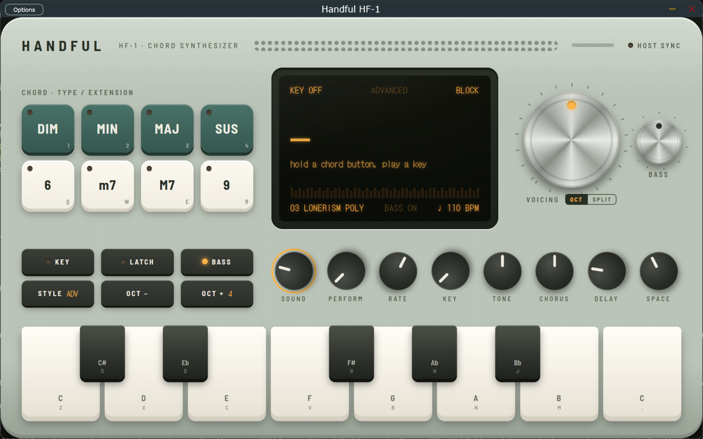

# Simpático Lírio

A chord synthesizer for songwriting: hold a chord button, play one key, turn the voicing
dial. It is inspired by the workflow of the Telepathic Instruments Orchid and built from its
public manual and reviews. It runs as a VST3 plugin or standalone app and is played from
any MIDI controller.



*The VST3 plugin window: MIN + 9 held, latched D, Arp mode at the host tempo.*

> Simpático Lírio is an independent project. It is not affiliated with, endorsed by, or connected to
> Telepathic Instruments. "Orchid" is their trademark and is used here only to describe what
> inspired this project. None of their sounds, code or artwork is used.

## What is in the box

| Orchid feature | Simpático Lírio |
|---|---|
| 8 chord buttons (DIM MIN MAJ SUS / 6 m7 M7 9) | same buttons and same combination rules (Min+9 = m9, 6+9 = 6/9, Dim+m7 = m7b5, ...) |
| Playstyles Simple / Advanced / Free | Simple = one type + one extension, Advanced = several extensions, Free = anything ("WTF") |
| Key Mode | diatonic chords in a major or minor key; out-of-key notes snap into the key; buttons still override |
| Voicing Dial (Octave / Split) | Octave: every step inverts the chord by one note. Split: chord tones fold around a moving split point |
| Bass engine + Bass Voicing Dial | separate mono synth; the dial walks the bass through the chord tones (slash chords) |
| Perform modes | Strum, Strum 2 Oct, Slop, Arp, Arp 2 Oct, Pattern, Harp, synced to the clock |
| 3 synth engines | virtual analog, 2-op FM, FM electric piano; 10 sounds plus 4 bass sounds |
| FX | drive, chorus, tempo-synced ping-pong delay, reverb |
| Beat machine | 10 synthesised patterns (Python prototype only) |
| Looper | record / play / overdub / undo / clear (Python prototype only) |
| MIDI out split across channels | ch 1 = perform notes, ch 2 = bass, ch 3 = block chords |

The sounds are original presets, not copies of the Orchid factory sounds.

## Repository layout

```
plugin/          VST3 + standalone (C++, JUCE 9) with a WebView2 front panel
lirio_proto/   the Python prototype (pygame panel, numba DSP)
docs/            screenshots
```

## Download

Windows 10/11 (64-bit) builds of the VST3 plugin and the standalone app are on the
[Releases page](https://github.com/marcoc2/SimpaticoLirio/releases/latest). Copy
`Simpatico Lirio.vst3` to `C:\Program Files\Common Files\VST3` and rescan in your DAW.

## Build the plugin (Windows)

Requirements: Visual Studio 2022 Build Tools (C++ workload), CMake 3.22+, git.

```
git clone -c core.longpaths=true --recursive https://github.com/marcoc2/SimpaticoLirio.git
cd SimpaticoLirio/plugin
cmake -B build -G "Visual Studio 17 2022" -A x64
cmake --build build --config Release
```

`core.longpaths` avoids "Filename too long" errors in JUCE's example folders when the clone
lives in a deep Windows path. The first configure downloads the WebView2 SDK from nuget.org. The VST3 ends up in
`plugin/build/SimpaticoLirio_artefacts/Release/VST3/`. Copy it to `C:\Program Files\Common Files\VST3`
and rescan in your DAW. See [plugin/README.md](plugin/README.md) for controls, MIDI mapping and
the UI bridge.

## Run the Python prototype

```
pip install -r requirements.txt
python -m lirio_proto
```

See [lirio_proto/README.md](lirio_proto/README.md).

## License

AGPL-3.0, see [LICENSE](LICENSE). JUCE is used under its AGPLv3 option. The bundled fonts
(DotGothic16, Barlow Semi Condensed) are under the SIL Open Font License; their licence files
are in `plugin/ui/fonts/`.
